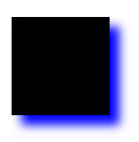

# ArkUI子系统Changelog

## cl.arkui.1 Video组件不再默认解析并自动播放拖拽信息中的视频资源

**访问级别**

公开接口

**变更原因**

Video组件默认允许拖入任意视频并自动播放的行为不符合终端用户预期，故需调整该默认规格。

**变更影响**

此变更涉及应用适配。

变更前：Video组件默认解析并自动播放拖拽信息中的视频资源。

变更后：Video组件不会默认解析并自动播放拖拽信息中的视频资源。

**起始API Level**

API 10

**变更发生版本**

从OpenHarmony SDK 5.1.0.47开始。

**变更的接口/组件**

Video组件。

**适配指导**

应用若需要使Video组件支持解析拖入的视频信息并自动播放，可通过如下代码实现：

```ts
import { unifiedDataChannel, uniformTypeDescriptor } from '@kit.ArkData';

@Entry
@Component
struct Index {
  @State videoSrc: Resource | string = $rawfile('video1.mp4');
  private controller: VideoController = new VideoController();

  build() {
    Column() {
      Video({
        src: this.videoSrc,
        controller: this.controller
      })
        .width('100%')
        .height(600)
        .onPrepared(() => {
          // 在onPrepared回调中执行controller的start方法，确保视频源更换后直接开始播放。
          this.controller.start();
        })
        .onDrop((e: DragEvent) => {
          // 外部视频拖入应用Video组件范围，松手后触发通过onDrop注册的回调。
          // 在DragEvent中会包含拖入的视频源信息，取出后赋值给状态变量videoSrc即可改变Video的视频源。
          let record = e.getData().getRecords()[0];
          if (record.getType() == uniformTypeDescriptor.UniformDataType.VIDEO) {
            let videoInfo = record as unifiedDataChannel.Video;
            this.videoSrc = videoInfo.videoUri;
          }
        })
    }
  }
}
```

## cl.arkui.2 使用媒体查询(@ohos.mediaquery)在2in1悬浮窗口监听页面宽度不再额外减去8vp

**访问级别**

公开接口

**变更原因**

2in1悬浮窗口下，计算页面宽度在窗口宽度基础上额外减去了8vp，导致页面宽度监听不准确，不符合开发者的预期，故需进行相应调整。

**变更影响**

此变更不涉及应用适配。

变更前：2in1悬浮窗口下，使用mediaQuery监听页面宽度，页面宽度 = 窗口宽度 - 8vp。

变更后：2in1悬浮窗口下，使用mediaQuery监听页面宽度，页面宽度 = 窗口宽度。

**起始API Level**

API 10

**变更发生版本**

从OpenHarmony SDK 5.1.0.47开始。

**变更的接口/组件**

@ohos.mediaquery.d.ts文件中matchMediaSync接口。

**适配指导**

默认行为变更，无需适配。

## cl.arkui.3 当Image组件的draggable接口接收到异常值时，其默认值将由false更改为true

**访问级别**

公开接口

**变更原因**

当Image组件的draggable接口接收到异常参数，如undefined或null时，其默认值将从false更改为true，从而默认启用拖拽功能。

**变更影响**

此变更涉及应用适配。

变更前：Image组件的draggable接口默认值为true，当传入异常值时，draggable为false，Image组件不可拖拽。

变更后：Image组件的draggable接口默认值为true，当传入异常值时，draggable为true，Image组件可拖拽。

**起始API Level**

API 9

**变更发生版本**

从OpenHarmony SDK 5.1.0.47开始。

**变更的接口/组件**

Image组件draggable接口。

**适配指导**

如果为Image组件设置了可拖拽（draggable）接口并传入了异常值，想要保持该组件不可拖拽，应将draggable设置为false。

示例：

```ts
@Entry
@Component
struct Index {
  build() {
    Column() {
      Image($r("app.media.startIcon"))
        .draggable(undefined)
    }
    .height('100%')
    .width('100%')
  }
}
```

## cl.arkui.4 CanvasRenderer的shadowColor属性传非法字符串时设置不生效

**访问级别**

公开接口

**变更原因**

shadowColor属性在传入某些非法字符串时，仍能产生阴影效果，与W3C标准不一致。

**变更影响**

| 变更前                                   | 变更后                                   |
| ---------------------------------------- | ---------------------------------------- |
| CanvasRenderer的shadowColor属性传某些不符合W3C标准的颜色字符串时仍设置生效。<br> | CanvasRenderer的shadowColor属性传某些不符合W3C标准的颜色字符串时设置不生效。<br> |


**起始API Level**

API 8

**变更发生版本**

从OpenHarmony SDK 5.1.0.47开始。

**变更的接口/组件**

CanvasRenderingContext2D和OffscreenCanvasRenderingContext2D的shadowColor接口。

**适配指导**

传异常参数行为变更，无需适配。
设置阴影颜色需要按照规范传入字符串参数：
1、使用rgb()或rgba()。例：context.shadowColor = 'rgba(255, 0, 0, 255)'
2、使用十六进制颜色值。例：context.shadowColor = '#FF0000'

**示例**

```ts
@Entry
@Component
struct Demo {
  private settings: RenderingContextSettings = new RenderingContextSettings(true)
  private context: CanvasRenderingContext2D = new CanvasRenderingContext2D(this.settings)

  build() {
    Flex({ direction: FlexDirection.Column, alignItems: ItemAlign.Center, justifyContent: FlexAlign.Center }) {
      Canvas(this.context)
        .width('100%')
        .height('100%')
        .onReady(() => {
          this.context.shadowBlur = 10
          this.context.shadowOffsetX = 10
          this.context.shadowOffsetY = 10
          /**
           * 变更前：设置生效为蓝色。
           * 变更后：设置不生效，没有阴影效果。
           */
          this.context.shadowColor = "2024-11-28T07:27:10.607Z"
          this.context.fillRect(10, 10, 100, 100)
        })
    }
    .width('100%')
    .height('100%')
  }
}
```