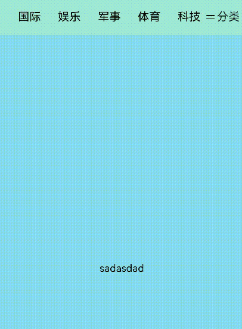

# 导航栏的使用编辑
## 场景描述
在大部分应用中导航栏的使用是非常普遍的，用户可以通过拖拽导航栏里的页签标题变换位置来调整导航栏的顺序。本文即为大家介绍导航栏的使用编辑。

## 效果呈现
本例最终效果图如下：



## 运行环境

本例基于以下环境开发，开发者也可以基于其他适配的版本进行开发：
- IDE: DevEco Studio 4.0 Release
- SDK: Ohos_sdk_public 4.0.10.13 (API Version 10 Release)

## 实现思路

本例包含的关键操作及其实现方案如下：
1. 自定义弹窗的展示：通过点击分类实现自定义弹窗的弹出
2. 自定义弹窗内部元素的排列、拖拽和换位：通过Grid()和GridItem()显示页签标题的网格排列，通过onItemDragStart、onItemDrop、onDrag事件完成拖拽换位。
3. Tabs页签的顺序与网格元素顺序同步：通过@State与@Link父子组件双向同步。

## 开发步骤
本例详细开发步骤如下，开发步骤仅展示相关步骤代码，全量代码请参考完整代码章节的内容。
1. UI框架的构建：通过Stack、Tabs、Row等关键组件将UI框架搭建起来。具体代码如下：
    ```ts
    ...
    Stack({ alignContent: Alignment.TopEnd }) {
      Tabs() {
        ForEach(this.tabBarArray, (item: string, index: number) => {
          TabContent() {
          }.tabBar(this.TabBuilder(index))
        }, (item: string) => JSON.stringify(item))
        TabContent() {
        }
        .tabBar(this.TabBuilder2(8))
      }
      .fadingEdge(true)
      .barHeight('7.2%')
      .barMode(BarMode.Scrollable)
      .barWidth('100%')
      .onChange((index: number) => {
        this.currentIndex = index;
      })
      .vertical(false)

      Row() {
        Divider()
          .vertical(true)
          .width(1)
          .height(18)
          .color(Color.Black)
        Image($r('app.media.ic_public_more'))
          .width(16)
          .height(16)
          .objectFit(ImageFit.Contain)
          .margin({ left: 4 })
        Text('分类')
          .fontSize(18)
          .opacity(0.8)
          .fontColor(Color.Black)
          .margin({ left: 2 })
      }.width('17%').height('7.2%').backgroundColor(Color.White)
      ...
    ```
2. 自定义弹窗的构建：首先将自定义弹窗样式设置为true,设置自定义弹窗的高度、显示位置、偏移量等。具体代码块如下：
    ```ts
    @CustomDialog
    struct CustomDialogExample{
      controller?:CustomDialogController
      @Link tabBarArray:Array<string>
      build(){
        Column(){
          Row({space:180}){
            Text('导航')
              .fontSize(30)
              .fontColor(Color.Black)
            Text('完成')
              .fontSize(20)
              .fontColor(Color.Green)
              .onClick(()=>{
                this.controller.close()
              })
          }
          Divider()
            .width('100%')
            .height(5)
            .color(Color.Black)
          Text('我的频道')
            .fontSize(20)
            .fontColor(Color.Black)
            .fontWeight(500)
            .textAlign(TextAlign.Start)
          Grid1({items:$tabBarArray})
        }.width('80%').height('100%').backgroundColor(Color.White).padding({top:60})
      }
    }
    ...
    dialogController:CustomDialogController|null = new CustomDialogController({
      builder:CustomDialogExample({tabBarArray:$tabBarArray}),
      // 允许点击遮蔽层退出
      autoCancel:true,
      // 弹窗在竖直方向上的对齐方式：右中对齐
      alignment:DialogAlignment.CenterEnd,
      offset:{dx:35,dy:16},
      // 弹窗容器样式允许自定义
      customStyle:true,
      backgroundColor:Color.White,
      cornerRadius:0
    })
    ```
3. 自定义弹窗内的拖拽和换位：设置属性editMode(true)设置Grid进入编辑模式，进入编辑模式可以进行拖拽Grid组件内部GridItem。在onItemDragStart回调中设置拖拽过程中显示的图片。在onItemDrop中获取拖拽起始位置，和拖入位置，在onDrag回调中完成交换数组位置逻辑。具体代码块如下：
    ```ts
    @Component
    export struct Grid1{
      @Link items:Array<string>
      @State text:string= 'drag'

      @Builder pixelMapBuilder(){
        Column(){
          Text(this.text)
            .fontSize(16)
            .backgroundColor(0xF9CF93)
            .width(80)
            .height(80)
            .textAlign(TextAlign.Center)
        }
      }

      changeIndex(index1:number,index2:number){
        let temp :Resource|string;
        temp = this.items[index1];
        this.items[index1] = this.items[index2];
        this.items[index2] = temp;
      }
      build(){
        Column({space:5}){
          Grid(){
            ForEach(this.items,(name:string,index:number)=>{
              GridItem(){
                Text(name)
                  .fontSize(16)
                  .backgroundColor(0xF9CF93)
                  .width(80)
                  .height(80)
                  .textAlign(TextAlign.Center)
              }
            })
          }
          .columnsTemplate('1fr 1fr 1fr')
          .columnsGap(10)
          .rowsGap(10)
          .onScrollIndex((first:number)=>{
            console.info(first.toString())
          })
          .width('90%')
          .backgroundColor(Color.White)
          .height('100%')
          .editMode(true)
          .onItemDragStart((event:ItemDragInfo,itemIndex:number)=>{
            this.text = this.items[itemIndex]
            return this.pixelMapBuilder()
          })
          .onItemDrop((event:ItemDragInfo,itemIndex:number,insertIndex:number,isSuccess:boolean)=>{
            if(insertIndex < this.items.length){
              this.changeIndex(itemIndex,insertIndex)
            }
          })
        }.width('100%')
        .margin({top:5})
      }
    }
    ```

## 完整代码
完整示例代码如下：
```ts
// Index.ets
import {Grid1} from './Grid'

@CustomDialog
struct CustomDialogExample{
  controller:CustomDialogController
  @Link tabBarArray:Array<string>
  build(){
    Column(){
      Row({space:180}){
        Text('导航')
          .fontSize(30)
          .fontColor(Color.Black)
        Text('完成')
          .fontSize(20)
          .fontColor(Color.Green)
          .onClick(()=>{
            this.controller.close()
          })
      }
      Divider()
        .width('100%')
        .height(5)
        .color(Color.Black)
      Text('我的频道')
        .fontSize(20)
        .fontColor(Color.Black)
        .fontWeight(500)
        .textAlign(TextAlign.Start)
      Grid1({items:$tabBarArray})
    }.width('80%').height('100%').backgroundColor(Color.White).padding({top:60})
  }
}

@Entry
@Component
struct TabBar {
  dialogController:CustomDialogController|null = new CustomDialogController({
    builder:CustomDialogExample({tabBarArray:$tabBarArray}),
    autoCancel:true,
    offset:{dx:0,dy:0},
    alignment:DialogAlignment.CenterEnd,
    customStyle:true,
    backgroundColor:Color.White,
    cornerRadius:0
  })
  @State currentIndex:number = 0;
  @State tabBarArray:Array<string> = ['关注','推荐','男生','女生','历史','传记','人性','动漫']

  @Builder TabBuilder(index:number){
    Column(){
      Text(this.tabBarArray[index])
        .height('100%')
        .padding({left:'5%',right:'5%'})
        .fontSize(this.currentIndex === index ? 24 : 18)
        .fontWeight(this.currentIndex === index ? 700 : 400)
        .fontColor(Color.Black)
    }
  }
  @Builder TabBuilder2(index:number){
    Column(){
      Text('')
        .height('100%')
        .padding({left:'5%',right:'10%'})
        .fontSize(this.currentIndex === index ? 24 : 18)
        .fontWeight(this.currentIndex === index ? 700 : 400)
        .fontColor(Color.Black)
    }
  }

  build() {
    Stack({ alignContent: Alignment.TopEnd }) {
      Tabs() {
        ForEach(this.tabBarArray, (item: string, index: number) => {
          TabContent() {
          }
          .tabBar(this.TabBuilder(index))
        }, (item: string) => JSON.stringify(item))
        TabContent() {
        }
        .tabBar(this.TabBuilder2(8))
      }
      .fadingEdge(true)
      .barHeight('7.2%')
      .barMode(BarMode.Scrollable)
      .barWidth('100%')
      .onChange((index: number) => {
        this.currentIndex = index;
      })
      .vertical(false)

      Row() {
        Divider()
          .vertical(true)
          .width(1)
          .height(18)
          .color(Color.Black)
        Image($r('app.media.ic_public_more'))
          .width(16)
          .height(16)
          .objectFit(ImageFit.Contain)
          .margin({ left: 4 })
        Text('分类')
          .fontSize(18)
          .opacity(0.8)
          .fontColor(Color.Black)
          .margin({ left: 2 })
      }.width('17%').height('7.2%').backgroundColor(Color.White)
      .onClick(() => {
        if (this.dialogController != null) {
          this.dialogController.open()
        }
      })
    }.width('100%')
  }
}
```
```ts
// Grid.ets
@Component
export struct Grid1{
  @Link items:Array<string>
  @State text:string= 'drag'

  @Builder pixelMapBuilder(){
    Column(){
      Text(this.text)
        .fontSize(16)
        .backgroundColor(0xF9CF93)
        .width(80)
        .height(80)
        .textAlign(TextAlign.Center)
    }
  }

  changeIndex(index1:number,index2:number){
    let temp :Resource|string;
    temp = this.items[index1];
    this.items[index1] = this.items[index2];
    this.items[index2] = temp;
  }
  build(){
    Column({space:5}){
      Grid(){
        ForEach(this.items,(name:string,index:number)=>{
          GridItem(){
            Text(name)
              .fontSize(16)
              .backgroundColor(0xF9CF93)
              .width(80)
              .height(80)
              .textAlign(TextAlign.Center)
          }
        })
      }
      .columnsTemplate('1fr 1fr 1fr')
      .columnsGap(10)
      .rowsGap(10)
      .onScrollIndex((first:number)=>{
        console.info(first.toString())
      })
      .width('90%')
      .backgroundColor(Color.White)
      .height('100%')
      .editMode(true)
      .onItemDragStart((event:ItemDragInfo,itemIndex:number)=>{
        this.text = this.items[itemIndex]
        return this.pixelMapBuilder()
      })
      .onItemDrop((event:ItemDragInfo,itemIndex:number,insertIndex:number,isSuccess:boolean)=>{
        if(insertIndex < this.items.length){
          this.changeIndex(itemIndex,insertIndex)
        }
      })
    }.width('100%')
    .margin({top:5})
  }
}
```
## 参考
[Tabs](../application-dev/reference/apis-arkui/arkui-ts/ts-container-tabs.md)

[Grid](../application-dev/reference/apis-arkui/arkui-ts/ts-container-grid.md)

[自定义弹窗](../application-dev/reference/apis-arkui/arkui-ts/ts-methods-custom-dialog-box.md)

[@Link装饰器：父子双向同步](../application-dev/quick-start/arkts-link.md)