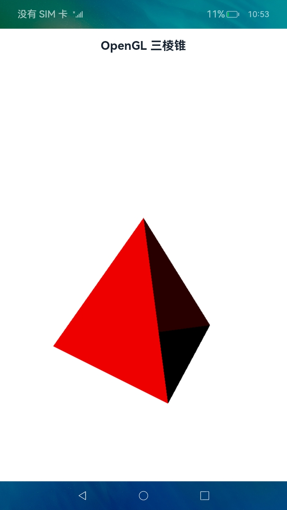
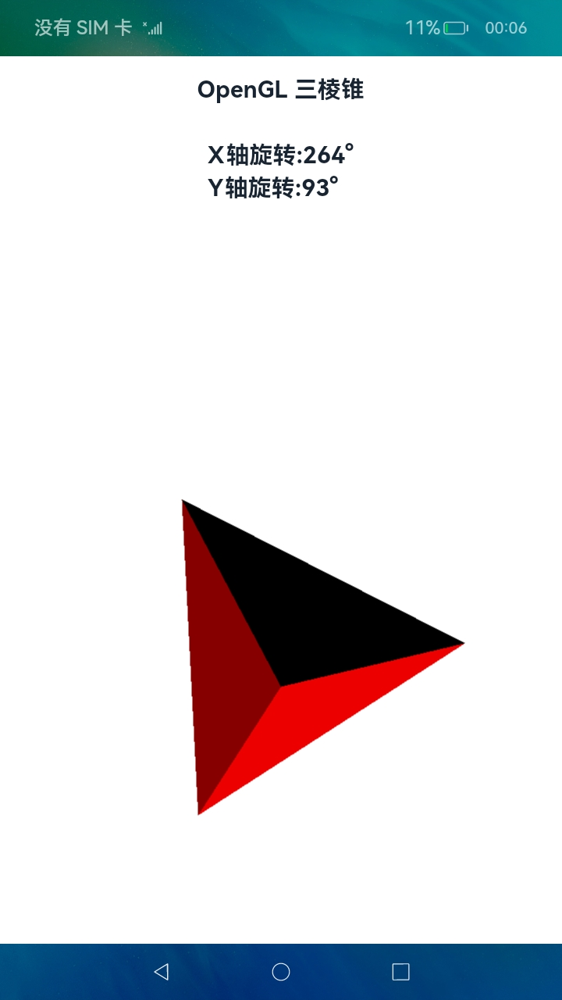
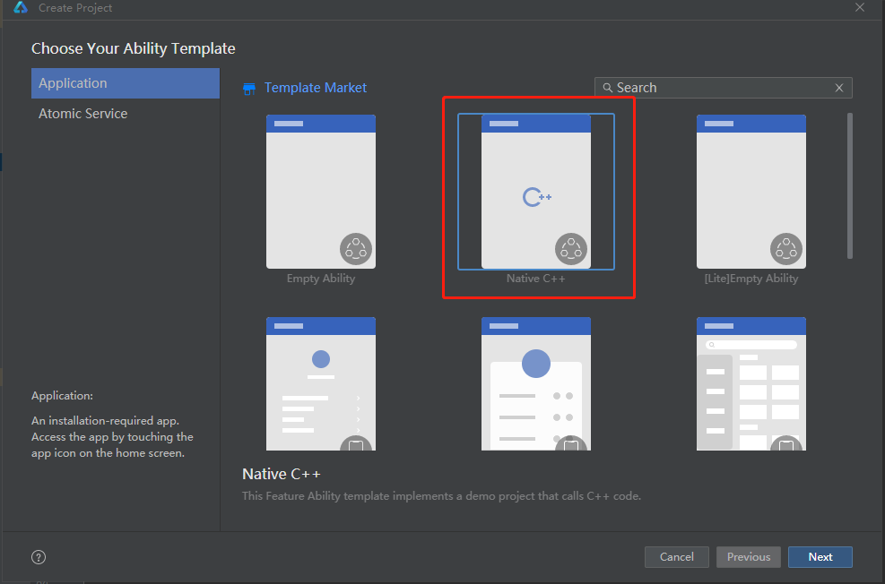
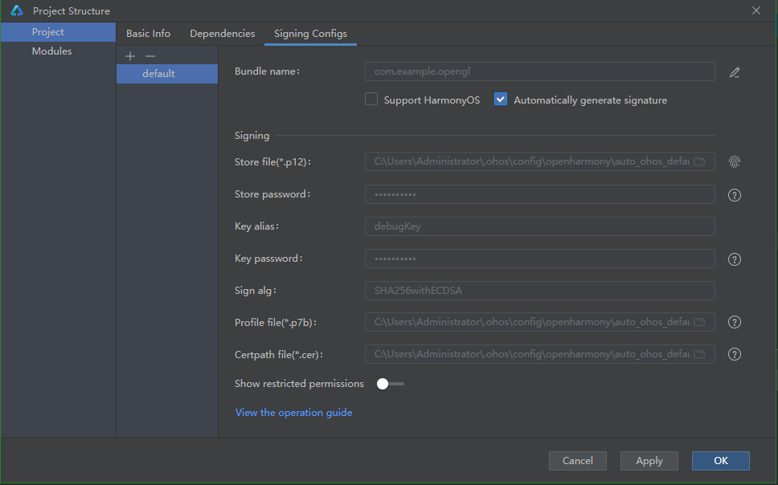

# 如何使用OpenGL绘制3D图形

## 场景介绍

XComponent控件常用于相机预览流的显示和游戏画面的绘制,在OpenHarmony上，可以配合Native Window创建OpenGL开发环境，并最终将OpenGL绘制的图形显示到XComponent控件。本文将采用"Native C++"模板，调用OpenGL ES图形库绘制3D图形（三棱锥），并将结果渲染到页面的XComponent控件中进行展示。同时，还可以在屏幕上通过触摸滑动手势对三棱锥进行旋转，最终得到不同角度的图形并显示到页面。

## 效果展示

| 首页                                                    | 滑动屏幕旋转变换                                                |
| ----------------------------------------------------- | ------------------------------------------------------- |
|  |  |

## 环境要求

- 本示例仅支持在标准系统上运行。

- IDE：DevEco Studio 3.1 Beta2

- SDK：Ohos_sdk_public 3.2.11.9 (API Version 9 Release)

## 实现思路

利用XComponent组件，并配合OpenHarmony的native侧提供的native window用来创建EGL/OpenGLES环境，进而使用标准的OpenGL ES相关API进行应用开发。其中
XComponent组件作为一种绘制组件，通常用于满足开发者较为复杂的自定义绘制需求，当XComponent设置为surface类型时通常用于EGL/OpenGLES和媒体数据写入，并将其显示在XComponent组件上。

## 开发步骤

### 1、环境搭建

我们首先要完成应用开发环境的搭建，本示例运行DAYU200开发板上。

- 搭建应用开发环境
  
  （1）开始前，请参考完成[DevEco Studio的安装和开发环境配置](https://developer.harmonyos.com/cn/docs/documentation/doc-guides/ohos-deveco-studio-overview-0000001263280421)。
  
  > 说明：
  > 
  > 为确保运行效果，本案例以使用DevEco Studio 3.1 Beta2 SDK：API9 （3.2.11.9）版本为例。
  
  
  
  （2）开发环境配置完成后，创建工程（模板选择“Native C++”)，选择eTS语言开发。

- 应用调测工程创建完成后，选择使用真机进行调测。
  
  （1）将搭载OpenHarmony标准系统的开发板与电脑连接。
  
  （2）点击File> Project Structure... > Project>SigningConfigs界面勾选“Automatically generate signature”，等待自动签名完成即可，最后点击“OK”。如下图所示：
  
  
  
  （3）在编辑窗口右上角的工具栏，点击"运行"按钮运行。
  
  

### 2、源码结构

- 代码结构分析，整个工程的代码结构如下：
  
  

- 文件说明如下：
  
  ```shell
  .
  └── main
      ├── cpp
      │   ├── app_napi.cpp      //C++与ArkTS中XComponent控件交互的napi接口实现
      │   ├── CMakeLists.txt    //CMake规则配置文件，NAPI C/C++代码编译需要配置该文件
      │   ├── include
      │   │   ├── app_napi.h
      │   │   ├── tetrahedron.h //三棱锥类实现头文件
      │   │   └── util
      │   ├── module.cpp        //NAPI模块注册
      │   ├── napi_manager.cpp
      │   ├── napi_util.cpp
      │   ├── tetrahedron.cpp   //三棱锥的绘制OpenGL实现
      │   └── type
      │       └── libentry
      ├── ets
      │   ├── entryability
      │   │   └── EntryAbility.ts
      │   └── pages
      │       └── Index.ets      //主页面
      ├── module.json5
      └── resources              //资源文件目录
          ├── base
          │   ├── element
          │   ├── media
          │   └── profile
          ├── en_US
          │   └── element
          ├── rawfile
          └── zh_CN
              └── element
  ```

### 3、绘制流程

- 3D绘制函数调用流程如下：

```mermaid
graph LR
A[napi init]
B[AppNapi Export]
C[AppNapi OnSurfaceCreatedCB]
D[AppNapi OnSurfaceCreated]
E[triangles Init]
F[triangles Update]


A ----> B
B ----> C
C -- Xcomponent, window--> D
D -- Native window --> E
E ----> F
```

- 在Tetrahedron类的Update方法中使用GLES3库着色器绘制，最终通过ArkUI的XComponent组件显示，流程如下：

```mermaid
graph LR
A[glClear]
B[设置gl_Position]
C[设置gl_FragColor]
D[glDrawArrays]


A ----> B
B ----> C
C ----> D
```

### 4、C++（OpenGL）实现

C++端方法源码是工程的entry/src/main/cpp/tetrahedron.cpp文件。

- 注册模块先定义一个模块，在entry/src/main/cpp/module.cpp文件中，对应结构体类型为napi_module，模块定义好后，调用NAPI提供的模块注册函数napi_module_register(napi_module* mod)注册到系统中；
  
  ```cpp
  /*
   * Napi Module define
   */
  static napi_module appNapiModule = {
      .nm_version = 1,
      .nm_flags = 0,
      .nm_filename = nullptr,
      .nm_register_func = Init,
      .nm_modname = "tetrahedron_napi",
      .nm_priv = ((void*)0),
      .reserved = { 0 },
  };
  
  /*
   * Module register function
   */
  extern "C" __attribute__((constructor)) void RegisterModule(void)
  {
      napi_module_register(&appNapiModule);
  }
  ```

- 调用OpenGL相关图形API绘制三棱锥
  
  （1）初始化
  
  ```cpp
  int32_t Tetrahedron::Init(void *window, int32_t width,  int32_t height)
  {
      window_ = window;
      width_ = width;
      height_ = height;
  
      LOGI("Init window = %{public}p, w = %{public}d, h = %{public}d.", window, width, height);
      mEglWindow = reinterpret_cast<EGLNativeWindowType>(window);
  
      // 1. create sharedcontext
      mEGLDisplay = eglGetDisplay(EGL_DEFAULT_DISPLAY);
      if (mEGLDisplay == EGL_NO_DISPLAY) {
          LOGE("unable to get EGL display.");
          return -1;
      }
  
      EGLint eglMajVers, eglMinVers;
      if (!eglInitialize(mEGLDisplay, &eglMajVers, &eglMinVers)) {
          mEGLDisplay = EGL_NO_DISPLAY;
          LOGE("unable to initialize display");
          return -1;
      }
  
      int version = 3;
      mEGLConfig = getConfig(version, mEGLDisplay);
      if (mEGLConfig == nullptr) {
          LOGE("GLContextInit config ERROR");
          return -1;
      }
  
      // 2. Create EGL Surface from Native Window
      EGLint winAttribs[] = {EGL_GL_COLORSPACE_KHR, EGL_GL_COLORSPACE_SRGB_KHR, EGL_NONE};
      if (mEglWindow) {
          mEGLSurface = eglCreateWindowSurface(mEGLDisplay, mEGLConfig, mEglWindow, winAttribs);
          if (mEGLSurface == nullptr) {
              LOGE("eglCreateContext eglSurface is null");
              return -1;
          }
      }
  
      // 3. Create EGLContext from
      int attrib3_list[] = {
          EGL_CONTEXT_CLIENT_VERSION, 2,
          EGL_NONE
      };
  
      mEGLContext = eglCreateContext(mEGLDisplay, mEGLConfig, mSharedEGLContext, attrib3_list);
      if (!eglMakeCurrent(mEGLDisplay, mEGLSurface, mEGLSurface, mEGLContext)) {
          LOGE("eglMakeCurrent error = %{public}d", eglGetError());
      }
  
      mProgramHandle = CreateProgram(vertexShader, fragmentShader);
      if (!mProgramHandle) {
          LOGE("Could not create CreateProgram");
          return -1;
      }
  
      LOGI("Init success.");
  
      return 0;
  }
  ```
  
  其中，顶点着色器实现如下：
  
  ```cpp
  char vertexShader[] =
      "attribute  vec4 apos;\n"
      "attribute  vec4 a_color;\n"
      "attribute  vec4 a_normal;\n"
      "uniform vec3 u_lightColor;\n"
      "uniform vec3 u_lightDirection;\n"
      "uniform mat4 a_mx;\n"
      "uniform mat4 a_my;\n"
      "varying  vec4 v_color;\n"
      "void main(){\n"
      "float radian = radians(30.0);\n"
      "float cos = cos(radian);\n"
      "float sin = sin(radian);\n"
      "  gl_Position = a_mx * a_my * vec4(apos.x, apos.y, apos.z, 1.0);\n"
      "  vec3 normal = normalize((a_mx * a_my * a_normal).xyz);\n"
      "  float dot = max(dot(u_lightDirection, normal), 0.0);\n"
      "  vec3 reflectedLight = u_lightColor * a_color.rgb * dot;\n"
      "  v_color = vec4(reflectedLight, a_color.a);\n"
      "}\n\0";
  ```
  
  （2）图像渲染
  
  ​    OpenGL ES图像渲染中着色器涉及到内置变量如下，所谓内置变量就是不用声明可以直接赋值，主要是为了实现特定的功能。

| 序号  | 内置变量          | 含义                | 值数据类型 |
| --- | ------------- | ----------------- | ----- |
| 1   | gl_PointSize  | 点渲染模式，方形点区域渲染像素大小 | float |
| 2   | gl_Position   | 顶点位置坐标            | vec4  |
| 3   | gl_FragColor  | 片元颜色值             | vec4  |
| 4   | gl_FragCoord  | 片元坐标，单位像素         | vec2  |
| 5   | gl_PointCoord | 点渲染模式对应点像素坐标      | vec2  |

  ​    而本次渲染涉及到两个内建变量：gl_Position和gl_FragColor；

  ​    其中，gl_Position变量表示最终传入片元着色器片元化要使用的顶点位置坐标，取值范围为-1.0到1.0，点超过该范围将自动被裁剪。初始化代码如下：

```cpp
gl_Position = a_mx * a_my * vec4(apos.x, apos.y, apos.z, 1.0);
```

  ​    

  a_my为y轴旋转矩阵，获取到旋转角度后初始化旋转矩阵；a_mx为x轴旋转矩阵，apos为绘制多面体点矩阵；

  这些值的初始化通过glUniformMatrix4fv函数实现：

```cpp
    mxGL_APICALL void GL_APIENTRY glUniformMatrix4fv(GLint location, GLsizei count, GLboolean transpose, const GLfloat *value)
```

  其中参数的含义如下：

| 序号  | 参数名       | 含义                                                            |
| --- | --------- | ------------------------------------------------------------- |
| 1   | location  | uniform对应的变量名                                                 |
| 2   | count     | 需要加载数据的数组元素的数量或者需要修改的矩阵的数量                                    |
| 3   | transpose | 指明矩阵是列优先(column major)矩阵（GL_FALSE）还是行优先(row major)矩阵（GL_TRUE） |
| 4   | value     | 指向由count个元素的数组的指针                                             |

​        gl_FragColor变量用于确定图形的颜色，可通过设置不同片段着色器的颜色，实现立体效果。

        片段着色器实现如下：

```cpp
char fragmentShader[] =
    "precision mediump float;\n"
    "varying vec4 v_color;\n"
    "void main () {\n"
    "   gl_FragColor = v_color;\n"
    "}\n\0";
```

       三棱锥核心绘制代码如下：

```cpp
 void Tetrahedron::Update(float angleX, float angleY)
 {
      angleY_ = angleY;
      angleX_ = angleX;
      glClearColor(1.0f, 1.0f, 1.0f, 1.0f);
      glClear(GL_COLOR_BUFFER_BIT);
      glUseProgram(mProgramHandle);

      unsigned int aposLocation = glGetAttribLocation(mProgramHandle, "apos");
      unsigned int a_color = glGetAttribLocation(mProgramHandle, "a_color");
      unsigned int a_normal = glGetAttribLocation(mProgramHandle, "a_normal");
      unsigned int u_lightColor = glGetUniformLocation(mProgramHandle, "u_lightColor");
      unsigned int u_lightDirection = glGetUniformLocation(mProgramHandle, "u_lightDirection");
      unsigned int mx = glGetUniformLocation(mProgramHandle, "a_mx");
      unsigned int my = glGetUniformLocation(mProgramHandle, "a_my");

     /**
     y轴旋转度
     **/
     float radianY = angleY * PI /180.0;
     float cosY = cosf(radianY);
     float sinY = sinf(radianY);
     float myArr[] = {
         cosY,0,-sinY,0,  0,1,0,0,  sinY,0,cosY,0,  0,0,0,1
    };
     glUniformMatrix4fv(my, 1,false, myArr);

     /**
     x轴旋转度
     **/
     float radianX = angleX * PI /180.0;
     float cosX = cosf(radianX);
     float sinX = sinf(radianX);
     float mxArr[] = {
         1,0,0,0,  0,cosX,-sinX,0,  0,sinX,cosX,0,  0,0,0,1
    };
     glUniformMatrix4fv(mx, 1,false, mxArr);

     /**
      给平行光传入颜色和方向数据，RGB(1,1,1),单位向量(x,y,z)
      **/
     glUniform3f(u_lightColor, 1.0, 1.0, 1.0);
     // 保证向量(x,y,z)的长度为1，即单位向量
     float x = 1.0/sqrt(15), y = 2.0/sqrt(15), z = 3.0/sqrt(15);
     glUniform3f(u_lightDirection, x,-y,z);

     /**
      创建顶点位置数据数组data，原点到各顶点的距离都为1
     **/
     float data[] = {
         -0.75, -0.50, -0.43, 0.75, -0.50, -0.43, 0.00, -0.50, 0.87,
         0.75, -0.50, -0.43, 0.00, -0.50, 0.87, 0.00, 1.00, 0.00,
         0.00, -0.50, 0.87, 0.00, 1.00, 0.00, -0.75, -0.50, -0.43,
         0.00, 1.00, 0.00, -0.75, -0.50, -0.43, 0.75, -0.50, -0.43,
     };

     /**
      创建顶点颜色数组colorData
      **/
     float colorData[] = {
         1,0,0, 1,0,0, 1,0,0,//红色——面1
         1,0,0, 1,0,0, 1,0,0,//红色——面2
         1,0,0, 1,0,0, 1,0,0,//红色——面3
         1,0,0, 1,0,0, 1,0,0 //红色——面4
     };

     /**
      顶点法向量数组normalData
      **/
     float normalData[] = {
         0.00, -1.00, 0.00,  0.00, -1.00, 0.00,  0.00, -1.00, 0.00,
         -0.83, -0.28, -0.48,  -0.83, -0.28, -0.48,  -0.83, -0.28, -0.48,
         -0.83, 0.28, 0.48,  -0.83, 0.28, 0.48,  -0.83, 0.28, 0.48,
         0.00, -0.28, 0.96,  0.00, -0.28, 0.96,  0.00, -0.28, 0.96,
     };

     /**
      创建缓冲区buffer，传入顶点位置数据data
      **/
     unsigned int buffer;
     glGenBuffers(1, &buffer);
     glBindBuffer(GL_ARRAY_BUFFER, buffer);
     glBufferData(GL_ARRAY_BUFFER, sizeof(data), data, GL_STATIC_DRAW);
     glVertexAttribPointer(aposLocation, 3, GL_FLOAT, GL_FALSE, 0, 0);
     glEnableVertexAttribArray(aposLocation);

     unsigned int normalBuffer;
     glGenBuffers(1, &normalBuffer);
     glBindBuffer(GL_ARRAY_BUFFER, normalBuffer);
     glBufferData(GL_ARRAY_BUFFER, sizeof(normalData), normalData, GL_STATIC_DRAW);
     glVertexAttribPointer(a_normal, 3, GL_FLOAT, GL_FALSE, 0, 0);
     glEnableVertexAttribArray(a_normal);

     /**
      创建缓冲区colorBuffer，传入顶点颜色数据colorData
      **/
     unsigned int colorBuffer;
     glGenBuffers(1, &colorBuffer);
     glBindBuffer(GL_ARRAY_BUFFER, colorBuffer);
     glBufferData(GL_ARRAY_BUFFER, sizeof(colorData), colorData, GL_STATIC_DRAW);
     glVertexAttribPointer(a_color, 3, GL_FLOAT, GL_FALSE, 0, 0);
     glEnableVertexAttribArray(a_color);

     /* 执行绘制命令 */
     glDrawArrays(GL_TRIANGLES, 0, 12);
 }
```

### 5、NAPI接口定义

接口定义为固定写法，在napi_property_descriptor desc[]中，我们需要使用DECLARE_NAPI_FUNCTION宏，以Add函数为例，将函数名字符串"Add"与具体的实现方法napi_value Add(napi_env env, napi_callback_info info)进行关联，即DECLARE_NAPI_FUNCTION("Add", Add)最终添加到desc[]。如下所示，其中UpdateAngle对应的是Native C++的接口，其应用端的接口对应为UpdateAngle，NAPI通过napi_define_properties接口将napi_property_descriptor结构体中的2个接口绑定在一起，并通过exports变量对外导出，使应用层可以调用UpdateAngle和getContext方法。

```cpp
/*
 * function for module exports
 */
EXTERN_C_START
static napi_value Init(napi_env env, napi_value exports)
{
    LOGE("Init");
    napi_property_descriptor desc[] = {
        DECLARE_NAPI_FUNCTION("getContext", NapiManager::GetContext),
        DECLARE_NAPI_FUNCTION("UpdateAngle", AppNapi::UpdateAngle),
    };

    NAPI_CALL(env, napi_define_properties(env, exports, sizeof(desc) / sizeof(desc[0]), desc));

    bool ret = NapiManager::GetInstance()->Export(env, exports);
    if (!ret) {
        LOGE("Init failed");
    }

    return exports;
}
EXTERN_C_END
```

### 6、NAPI接口实现

​    Tetrahedron::UpdateAngle：传入angleX和angleY两个参数，分别为为绕X，Y轴的旋转角度；作为参数调用```Tetrahedron::UpdateAngle(float angleX, float angleY)```重新渲染，具体代码如下：

```cpp
napi_value AppNapi::UpdateAngle(napi_env env, napi_callback_info info){
    LOGE("Tetrahedron UpdateAngle");
    size_t requireArgc = 2;
    size_t argc = 2;
    int speed = 3;
    napi_value args[2] = {nullptr};

    napi_get_cb_info(env, info, &argc, args , nullptr, nullptr);

    napi_valuetype valuetype0;
    napi_typeof(env, args[0], &valuetype0);

    napi_valuetype valuetype1;
    napi_typeof(env, args[1], &valuetype1);

    double offsetX;
    napi_get_value_double(env, args[0], &offsetX);

    double offsetY;
    napi_get_value_double(env, args[1], &offsetY);

    /* 处理offsetX偏移角度 */
    float tetrahedron_angleX = tetrahedron_->GetAngleX();
    float tetrahedron_angleY = tetrahedron_->GetAngleY();

    /* 上下滑动绕x轴 */
    if(offsetY < 0){
        tetrahedron_angleX = tetrahedron_angleX + speed;
    }
    else{
        tetrahedron_angleX = tetrahedron_angleX - speed;
    }

    /* 左右滑动绕y轴 */
    if(offsetX < 0){
        triangles_angleY = triangles_angleY + speed;
    }
    else{
        triangles_angleY = triangles_angleY - speed;
    }

    tetrahedron_angleY = normalize(tetrahedron_angleY);
    tetrahedron_angleX = normalize(tetrahedron_angleX);
    tetrahedron_->Update(tetrahedron_angleX, tetrahedron_angleY);

    /* 创建一个数组 */
    napi_value ret;
    napi_create_array(env, &ret);

    /* 设置数组并返回 */
    napi_value num;
    napi_create_int32(env, tetrahedron_angleX, &num);
    napi_set_element(env, ret, 0, num);
    napi_create_int32(env, tetrahedron_angleY, &num);
    napi_set_element(env, ret, 1, num);

    return ret;
}
```

​    GetContext：得到渲染所XComponent的上下文context，以便后续绑定XComponentID渲染，具体代码如下：

```cpp
napi_value NapiManager::GetContext(napi_env env, napi_callback_info info)
{
    napi_status status;
    napi_value exports;
    size_t argc = 1;
    napi_value args[1];
    NAPI_CALL(env, napi_get_cb_info(env, info, &argc, args, nullptr, nullptr));

    if (argc != 1) {
        napi_throw_type_error(env, NULL, "Wrong number of arguments");
        return nullptr;
    }

    napi_valuetype valuetype;
    status = napi_typeof(env, args[0], &valuetype);
    if (status != napi_ok) {
        return nullptr;
    }
    if (valuetype != napi_number) {
        napi_throw_type_error(env, NULL, "Wrong arguments");
        return nullptr;
    }

    int64_t value;
    NAPI_CALL(env, napi_get_value_int64(env, args[0], &value));
    NAPI_CALL(env, napi_create_object(env, &exports));

    switch (value) {
        case int64_t(ContextType::APP_LIFECYCLE):
            {
                /* AppInit 对应 app.ets中的应用生命周期 onCreate, onShow, onHide, onDestroy */
                LOGD("GetContext APP_LIFECYCLE");
                /* Register App Lifecycle */
                napi_property_descriptor desc[] = {
                    DECLARE_NAPI_FUNCTION("onCreate", NapiManager::NapiOnCreate),
                    DECLARE_NAPI_FUNCTION("onShow", NapiManager::NapiOnShow),
                    DECLARE_NAPI_FUNCTION("onHide", NapiManager::NapiOnHide),
                    DECLARE_NAPI_FUNCTION("onDestroy", NapiManager::NapiOnDestroy),
                };
                NAPI_CALL(env, napi_define_properties(env, exports, sizeof(desc) / sizeof(desc[0]), desc));
            }

            break;
        case int64_t(ContextType::JS_PAGE_LIFECYCLE):
            {
                /* JS Page */
                LOGD("GetContext JS_PAGE_LIFECYCLE");
                napi_property_descriptor desc[] = {
                    DECLARE_NAPI_FUNCTION("onPageShow", NapiManager::NapiOnPageShow),
                    DECLARE_NAPI_FUNCTION("onPageHide", NapiManager::NapiOnPageHide),
                };
                NAPI_CALL(env, napi_define_properties(env, exports, sizeof(desc) / sizeof(desc[0]), desc));
            }
            break;
        default:
            LOGE("unknown type");
    }
    return exports;
}
```

​    Export：先拿到XComponentID等信息后，通过NapiManager得到context，再通过context得到处理3D绘画的appNapi类并进行相应输出处理。部分代码如下（具体请查看源码）：

```cpp
bool NapiManager::Export(napi_env env, napi_value exports)
{
    napi_status status;
    napi_value exportInstance = nullptr;
    OH_NativeXComponent *nativeXComponent = nullptr;
    int32_t ret;
    char idStr[OH_XCOMPONENT_ID_LEN_MAX + 1] = { };
    uint64_t idSize = OH_XCOMPONENT_ID_LEN_MAX + 1;

    status = napi_get_named_property(env, exports, OH_NATIVE_XCOMPONENT_OBJ, &exportInstance);
    if (status != napi_ok) {
        return false;
    }

    status = napi_unwrap(env, exportInstance, reinterpret_cast<void**>(&nativeXComponent));
    if (status != napi_ok) {
        return false;
    }

    ret = OH_NativeXComponent_GetXComponentId(nativeXComponent, idStr, &idSize);
    if (ret != OH_NATIVEXCOMPONENT_RESULT_SUCCESS) {
        return false;
    }

    std::string id(idStr);
    auto context = NapiManager::GetInstance();
    if (context) {
        context->SetNativeXComponent(id, nativeXComponent);
        auto app = context->GetApp(id);
        app->SetNativeXComponent(nativeXComponent);
        app->Export(env, exports);
        return true;
    }

    return false;
}
```

### 7、ArkTS接口定义

（1）修改 index.d.ts 用于对外提供方法、说明（命名为tetrahedron_napi.d.ts）。

```ts
//传入x，y偏移量并返回x，y旋转角
export const UpdateAngle:(offsetX:number,offsetY:number)=>Array;
```

（2）在同目录下的 oh-package.json5 文件中将 tetrahedron_napi.d.ts 与cpp文件关联起来。

```json
{
  "name": "libtetrahedron_napi.so",
  "types": "./tetrahedron_napi.d.ts",
  "version": "1.0.0",
  "description": "Please describe the basic information."
}
```

（3）修改项目的oh-package.json5文件，添加动态库。

```json
{
  "license": "",
  "devDependencies": {
    "@types/libtetrahedron_napi.so": "file:./src/main/cpp/type/libentry"
  },
  "author": "",
  "name": "entry",
  "description": "Please describe the basic information.",
  "main": "",
  "version": "1.0.0",
  "dependencies": {}
}
```

### 8、CMake规则配置

entry/src/main/cpp/CMakeLists.txt是CMake规则文件。

`project`：用于设置项目(project)的名称。

`set(CMAKE_CXX_STANDARD 11)`：设置C++标准。

`include_directories`：用于包含头文件。

`add_library`：编译产生链接库。

`target_link_libraries`：指定链接给定目标和/或其依赖项时要使用的库或标志，在PUBLIC字段后的库会被链接到tetrahedron_napi中。

```textile
# the minimum version of CMake.
cmake_minimum_required(VERSION 3.4.1)

project(TetrahedronHap)

set(NATIVE_ROOT_PATH ${CMAKE_CURRENT_SOURCE_DIR})

include_directories(${NATIVE_ROOT_PATH}
                    ${NATIVE_ROOT_PATH}/include
                    ${NATIVE_ROOT_PATH}/include/util)

add_library(triangles_napi SHARED
            module.cpp
            app_napi.cpp
            tetrahedron.cpp
            napi_manager.cpp
            napi_util.cpp)


target_link_libraries(tetrahedron_napi PUBLIC EGL)
target_link_libraries(tetrahedron_napi PUBLIC GLESv3)
target_link_libraries(tetrahedron_napi PUBLIC hilog_ndk.z)
target_link_libraries(tetrahedron_napi PUBLIC ace_ndk.z)
target_link_libraries(tetrahedron_napi PUBLIC ace_napi.z)
target_link_libraries(tetrahedron_napi PUBLIC libc++.a)
target_link_libraries(tetrahedron_napi PUBLIC z)
target_link_libraries(tetrahedron_napi PUBLIC uv)
target_link_libraries(tetrahedron_napi PUBLIC libace_napi.z.so)
```

### 9、ArkTS实现

界面实现部分代码如下（具体请参考源码）,其中：libraryname参数对应先前设置的模块名：tetrahedron_napi

```ts
import hilog from '@ohos.hilog';
import tetrahedron_napi from 'libtetrahedron_napi.so'

@Entry
@Component
struct Index {
  private xcomponentContext = null;
  private xcomponentId = 'tetrahedron';
  private offset_x: number = 0.000;
  private offset_y: number = 0.000;
  private index: number = 0;
  private type_: number = 5;
  private touchTypeDown: number = 0;
  private touchTypeUp: number = 1;
  private touchTypeMove: number = 2;
  private touchTypeCancel: number = 3;
  @State startVisible: Visibility = Visibility.Visible;

  @State angleArray: Array<number> = new Array<number>();
  private panOption: PanGestureOptions = new PanGestureOptions({ direction: PanDirection.All })
  @State offsetX: number = 0
  @State offsetY: number = 0
  @State positionX: number = 0
  @State positionY: number = 0
  @State message: string = 'wu'

  async aboutToAppear() {
  }

  build() {
    Column() {
      Text($r('app.string.EntryAbility_desc'))
        .fontSize($r('app.float.head_font_24'))
        .lineHeight($r('app.float.wh_value_33'))
        .fontFamily('HarmonyHeiTi-Bold')
        .fontWeight(FontWeight.Bold)
        .fontColor($r('app.color.font_color_182431'))
        .textOverflow({ overflow: TextOverflow.Ellipsis })
        .textAlign(TextAlign.Start)
        .margin({ top: $r('app.float.wh_value_13'), bottom: $r('app.float.wh_value_15') });

      Text(this.angleArray[0]&this.angleArray[1]?'X轴旋转:'+this.angleArray[0].toString() +'°\nY轴旋转:'+this.angleArray[1].toString() + '°':'')
        .fontSize($r('app.float.head_font_24'))
        .lineHeight($r('app.float.wh_value_33'))
        .fontFamily('HarmonyHeiTi-Bold')
        .fontWeight(FontWeight.Bold)
        .fontColor($r('app.color.font_color_182431'))
        .textOverflow({ overflow: TextOverflow.Ellipsis })
        .textAlign(TextAlign.Start)
        .margin({ top: $r('app.float.wh_value_13'), bottom: $r('app.float.wh_value_15') });

      Stack({ alignContent: Alignment.Center }) {
        XComponent({ id: this.xcomponentId, type: 'surface', libraryname: 'tetrahedron_napi' })
          .onLoad((context) => {
            hilog.info(0x0000, 'Xcomponent', 'onLoad')
            this.xcomponentContext = context;
            globalThis.xcomponentContext = this.xcomponentContext;
            globalThis.xcomponentId = this.xcomponentId;
            globalThis.touchTypeDown = this.touchTypeDown;
            globalThis.touchTypeUp = this.touchTypeUp;
            globalThis.type_ = this.type_;
            globalThis.index = this.index;
            globalThis.touchTypeMove = this.touchTypeMove;
            globalThis.touchTypeCancel = this.touchTypeCancel;
            globalThis.offset_x = this.offset_x;
            globalThis.offset_y = this.offset_y;
          })
          .width($r('app.float.wh_value_362'))
          .height($r('app.float.wh_value_362'))
          .key('tetrahedron')
          .backgroundColor('#00000000')
          .onDestroy(() => {
            globalThis.flag = false;
            hilog.info(0x0000, "Xcomponent", 'onDestroy')
          })
      }
      .gesture(
        PanGesture(this.panOption)
          .onActionStart((event: GestureEvent) => {
            console.info('onActionStart');
          })
          .onActionUpdate((event: GestureEvent) => {
            this.angleArray = tetrahedron_napi.UpdateAngle(event.offsetX, event.offsetY);
            hilog.info(0x0000, "Gesture", 'offSet:' + event.offsetX + "," + event.offsetY);
          })
          .onActionEnd(() => {
            this.positionX = this.offsetX;
            this.positionY = this.offsetY;
            console.info('onActionEnd');
          })
      )
      .width('100%')
      .height('100%')
      .backgroundColor('#00000000')
    }
  }
}
```
